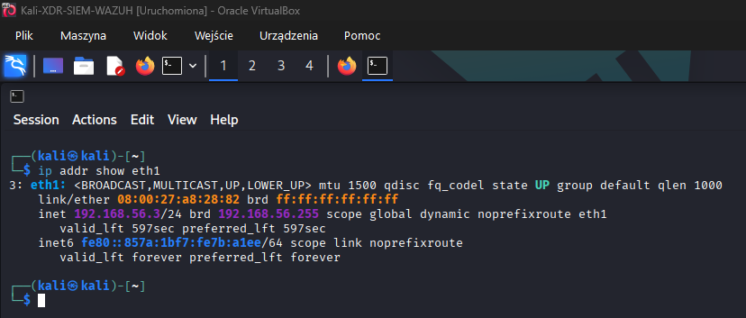
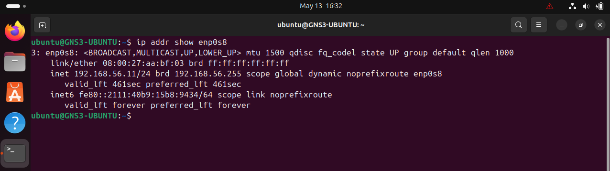
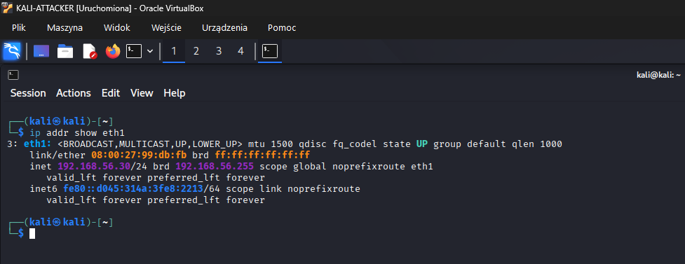

# Lab Architecture

## Purpose

This document describes the architecture of the Wazuh XDR/SIEM Kali Lab.

The goal of this lab is to build a small monitored environment where security events generated from a dedicated Kali Linux attacker machine are collected from an Ubuntu endpoint, analyzed by Wazuh Manager and visualized in Wazuh Dashboard.

## Environment overview

The laboratory environment is based on three virtual machines connected to the same isolated virtual network.

| Machine | Role | IP address | Description |
|---|---|---:|---|
| Kali Linux | Wazuh Manager, Indexer and Dashboard | 192.168.56.3 | Central SIEM/XDR host responsible for receiving, analyzing and displaying alerts |
| Ubuntu Linux | Monitored endpoint | 192.168.56.11 | Linux endpoint with the Wazuh Agent installed |
| Kali Linux | Attacker machine | 192.168.56.30 | Machine used to generate controlled attack scenarios |

## Logical architecture

```text
+--------------------+          +------------------------+
| Kali Linux         |          | Ubuntu Endpoint        |
| Attacker machine   | -------> | Wazuh Agent            |
| 192.168.56.30      |          | 192.168.56.11          |
| nmap, hydra, etc.  |          |                        |
+--------------------+          +------------------------+
                                         |
                                         | Agent communication
                                         | TCP/UDP 1514, TCP 1515
                                         v
                              +------------------------+
                              | Kali Linux             |
                              | Wazuh Manager          |
                              | Wazuh Indexer          |
                              | Wazuh Dashboard        |
                              | 192.168.56.3           |
                              +------------------------+
```

## Virtual machines

### Kali Linux - Wazuh host

This virtual machine is used as the central Wazuh server.  
It runs the main Wazuh components:

- Wazuh Manager,
- Wazuh Indexer,
- Wazuh Dashboard.

The machine receives events from the monitored Ubuntu endpoint and provides the web interface used to analyze alerts.

Lab network interface:

```text
eth1: 192.168.56.3/24
```

Screenshot:



### Ubuntu Linux - monitored endpoint

This virtual machine represents the monitored host.  
The Wazuh Agent is installed on this system and sends collected logs and events to the Wazuh Manager.

Lab network interface:

```text
enp0s8: 192.168.56.11/24
```

Screenshot:



### Kali Linux - attacker machine

This virtual machine is used only for controlled attack simulation inside the isolated lab network.

Example tools used on this machine:

- Nmap,
- Hydra,
- hping3.

Lab network interface:

```text
eth1: 192.168.56.30/24
```

Screenshot:



## Network assumptions

All machines are connected to the same isolated VirtualBox host-only network:

```text
192.168.56.0/24
```

Basic connectivity checks:

```bash
ping 192.168.56.3
ping 192.168.56.11
ping 192.168.56.30
```

Required communication:

| Source | Destination | Purpose |
|---|---|---|
| Ubuntu endpoint | Kali Wazuh host | Sending logs and agent data to Wazuh Manager |
| Kali attacker | Ubuntu endpoint | Generating controlled attack scenarios |
| User browser | Kali Wazuh host | Accessing Wazuh Dashboard |

## Wazuh components used in the lab

The lab uses the following Wazuh components:

- **Wazuh Agent** - installed on the Ubuntu endpoint; collects logs and security events.
- **Wazuh Manager** - analyzes events received from the agent using rules and decoders.
- **Wazuh Indexer** - stores and indexes collected security data.
- **Wazuh Dashboard** - provides a web interface for reviewing alerts and security events.

## Data flow

1. The Kali attacker generates controlled activity against the Ubuntu endpoint.
2. The Ubuntu endpoint records system and authentication events in local logs.
3. Wazuh Agent collects selected logs and sends them to Wazuh Manager.
4. Wazuh Manager analyzes the events using rules and decoders.
5. Wazuh Indexer stores and indexes the collected security data.
6. Wazuh Dashboard displays alerts and visualizations.
7. Selected alerts can be mapped to MITRE ATT&CK techniques.

## Planned detection examples

The lab is prepared for the following detection scenarios:

- network reconnaissance using Nmap,
- SSH brute-force attempts using Hydra,
- suspicious authentication activity,
- privilege-related command execution attempts,
- Linux system log analysis,
- alert review in Wazuh Dashboard.

## Security note

This laboratory is intended only for educational and controlled testing purposes.  
All attack simulations should be performed only inside the isolated lab network.