# Wazuh Verification

## Purpose

This document contains commands used to verify whether the Wazuh components and the monitored endpoint are working correctly in the lab environment.

The lab uses the following machines:

| Machine | Role | IP address |
|---|---|---:|
| Kali Linux | Wazuh Manager, Indexer and Dashboard | 192.168.56.3 |
| Ubuntu Linux | Monitored endpoint with Wazuh Agent | 192.168.56.11 |
| Kali Linux | Attacker machine | 192.168.56.30 |

## 1. Kali Wazuh host IP address

Run on the Kali Linux Wazuh host:

```bash
ip addr
```

Expected lab interface:

```text
eth1: 192.168.56.3/24
```

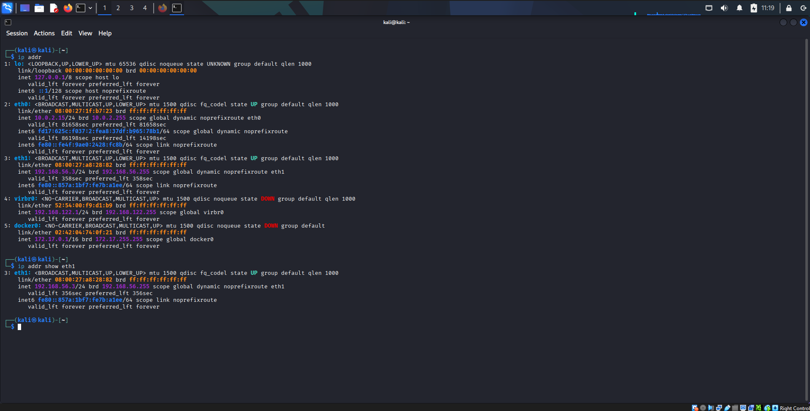

## 2. Wazuh Manager service

Run on the Kali Linux Wazuh host:

```bash
sudo systemctl status wazuh-manager
```

Expected result:

```text
active (running)
```

The Wazuh Manager is responsible for receiving and analyzing events from connected agents.

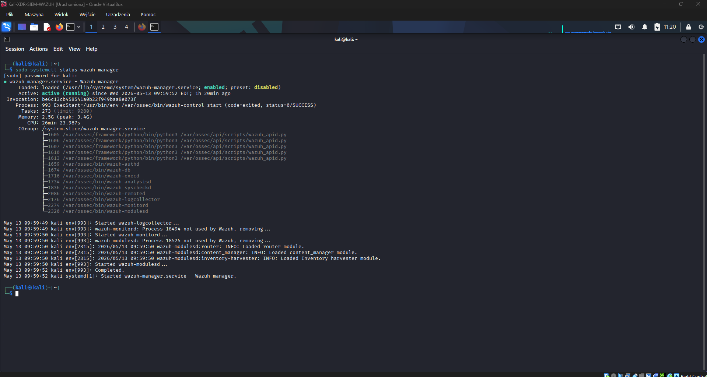

## 3. Wazuh Indexer service

Run on the Kali Linux Wazuh host:

```bash
sudo systemctl status wazuh-indexer
```

Expected result:

```text
active (running)
```

The Wazuh Indexer stores and indexes alerts and security events.

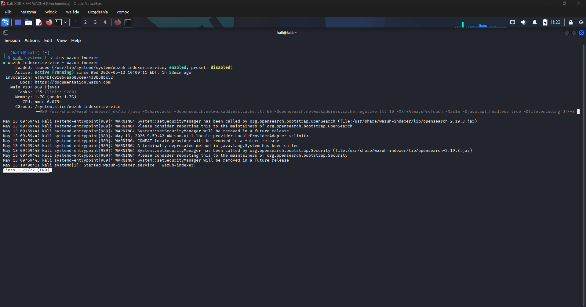

## 4. Wazuh Dashboard service

Run on the Kali Linux Wazuh host:

```bash
sudo systemctl status wazuh-dashboard
```

Expected result:

```text
active (running)
```

The Wazuh Dashboard provides the web interface used to review alerts and security events.

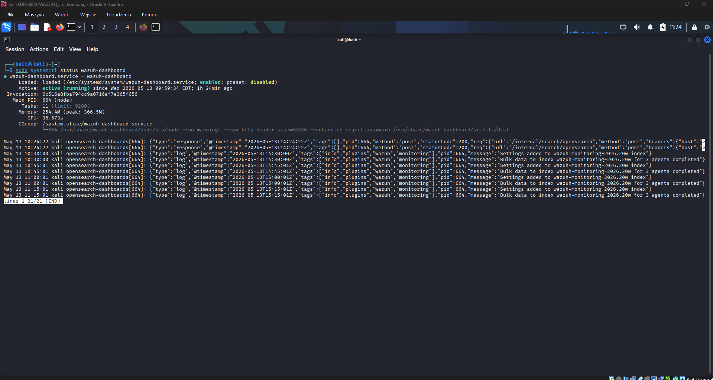

## 5. Wazuh Indexer API

Run on the Kali Linux Wazuh host:

```bash
sudo curl -k -u admin https://192.168.56.3:9200/_cat/nodes?v
```

This confirms that the Wazuh Indexer API is reachable.

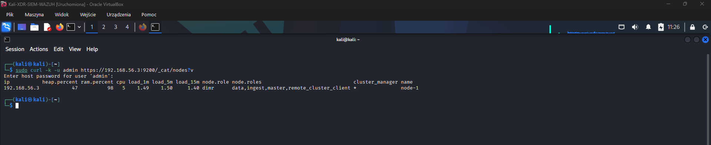

## 6. Filebeat logs

Run on the Kali Linux Wazuh host:

```bash
sudo tail -f /var/log/filebeat/filebeat
```

Filebeat is responsible for forwarding alerts and events from Wazuh Manager to Wazuh Indexer.

Expected behavior:

```text
Filebeat should run without repeated connection or authentication errors.
```

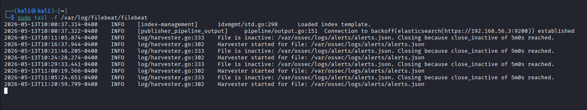

## 7. Ubuntu endpoint IP address

Run on the Ubuntu endpoint:

```bash
ip addr
```

Expected lab interface:

```text
enp0s8: 192.168.56.11/24
```

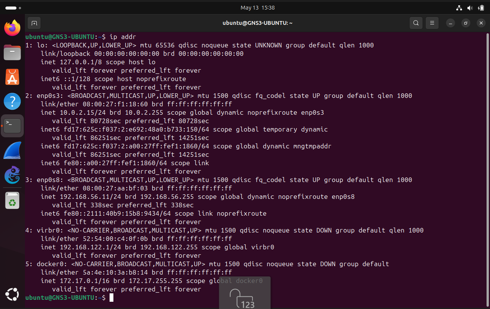

## 8. Wazuh Agent service on Ubuntu

Run on the Ubuntu endpoint:

```bash
sudo systemctl status wazuh-agent
```

Expected result:

```text
active (running)
```

The Wazuh Agent collects logs and security events from the monitored Ubuntu endpoint and sends them to Wazuh Manager.

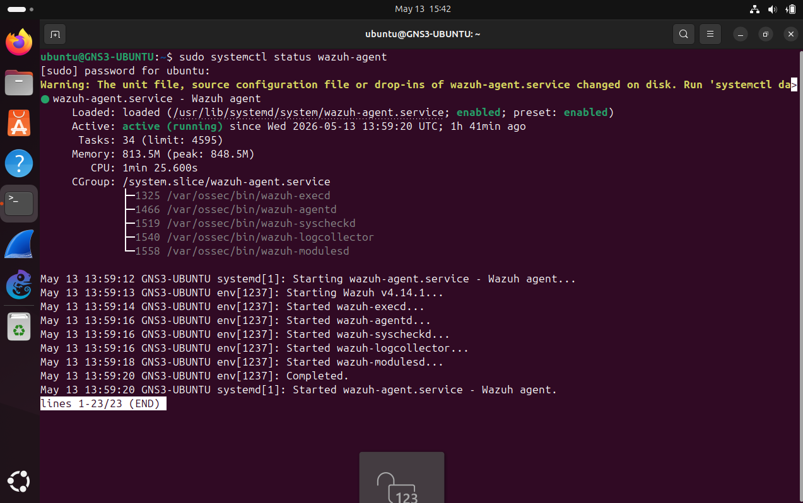

## 9. Wazuh Agent logs on Ubuntu

Run on the Ubuntu endpoint:

```bash
sudo tail -f /var/ossec/logs/ossec.log
```

This log is useful for checking whether the agent connects correctly to the Wazuh Manager.

Expected behavior:

```text
The agent should connect to the manager without repeated connection errors.
```

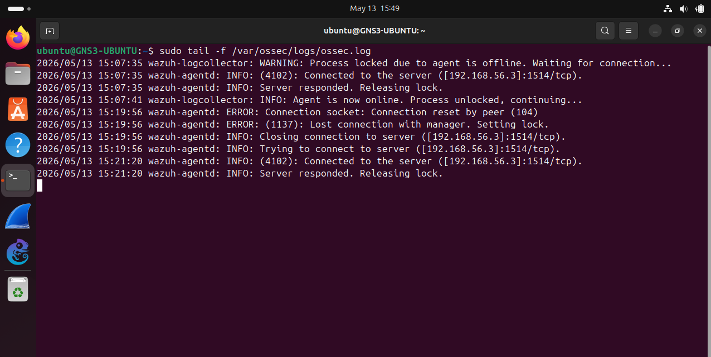

## 10. Kali attacker IP address

Run on the Kali Linux attacker machine:

```bash
ip addr
```

Expected lab interface:

```text
eth1: 192.168.56.30/24
```

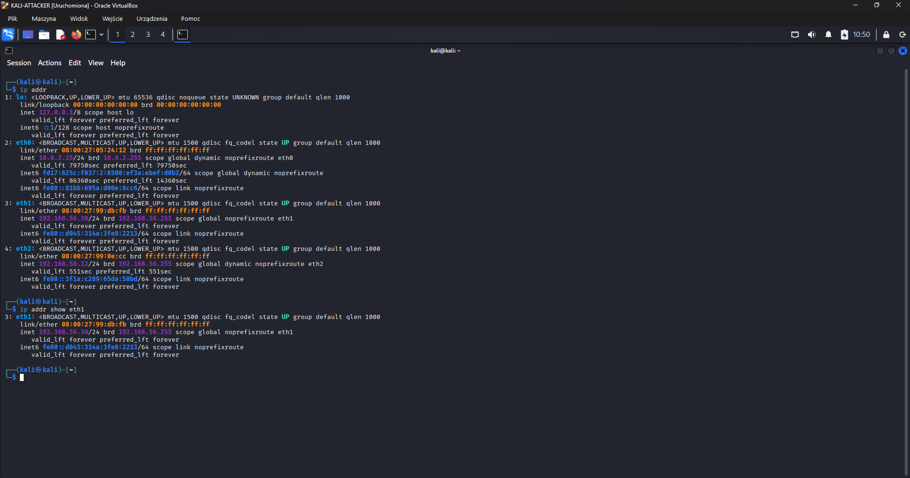

## 11. Network connectivity

From the Kali attacker to the Ubuntu endpoint:

```bash
ping 192.168.56.11
```

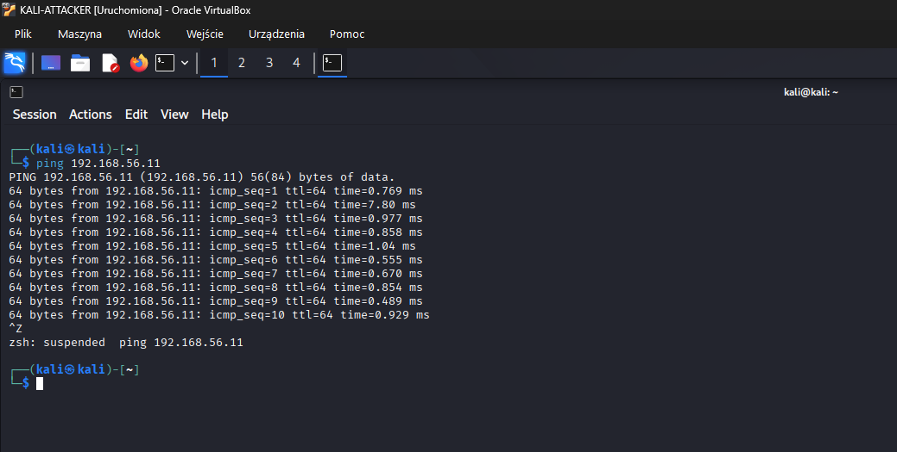

From the Ubuntu endpoint to the Kali Wazuh host:

```bash
ping 192.168.56.3
```

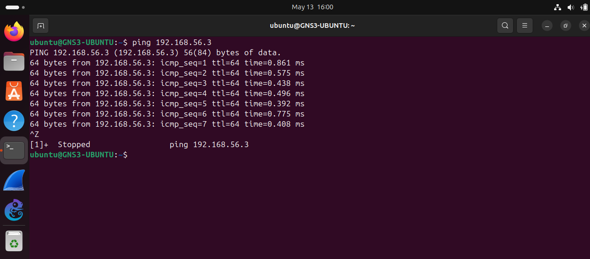

From the Kali Wazuh host to the Ubuntu endpoint and Kali attacker:

```bash
ping 192.168.56.11
ping 192.168.56.30
```

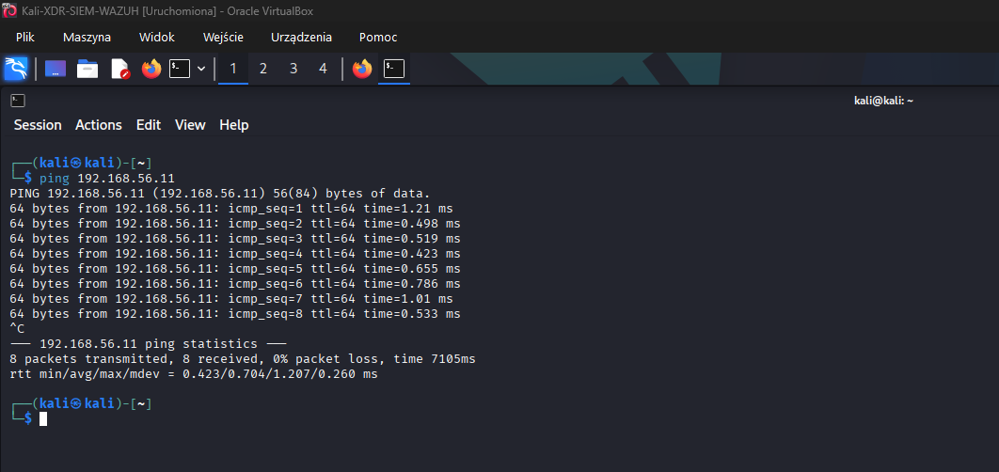

Expected result:

```text
Packets should be transmitted and received without packet loss.
```

## 12. Verification checklist

| Check | Command | Expected result |
|---|---|---|
| Kali Wazuh host IP | `ip addr` | `192.168.56.3/24` |
| Ubuntu endpoint IP | `ip addr` | `192.168.56.11/24` |
| Kali attacker IP | `ip addr` | `192.168.56.30/24` |
| Wazuh Manager | `sudo systemctl status wazuh-manager` | `active (running)` |
| Wazuh Indexer | `sudo systemctl status wazuh-indexer` | `active (running)` |
| Wazuh Dashboard | `sudo systemctl status wazuh-dashboard` | `active (running)` |
| Wazuh Agent | `sudo systemctl status wazuh-agent` | `active (running)` |
| Indexer API | `sudo curl -k -u admin https://192.168.56.3:9200/_cat/nodes?v` | Node information displayed |
| Filebeat logs | `sudo tail -f /var/log/filebeat/filebeat` | No repeated connection errors |
| Agent logs | `sudo tail -f /var/ossec/logs/ossec.log` | Agent connected to manager |
| Kali attacker to Ubuntu | `ping 192.168.56.11` | Connectivity confirmed |
| Ubuntu to Wazuh host | `ping 192.168.56.3` | Connectivity confirmed |