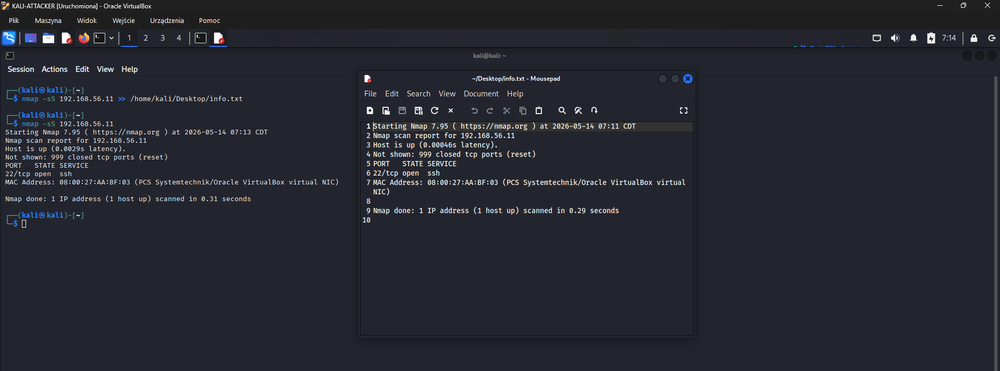
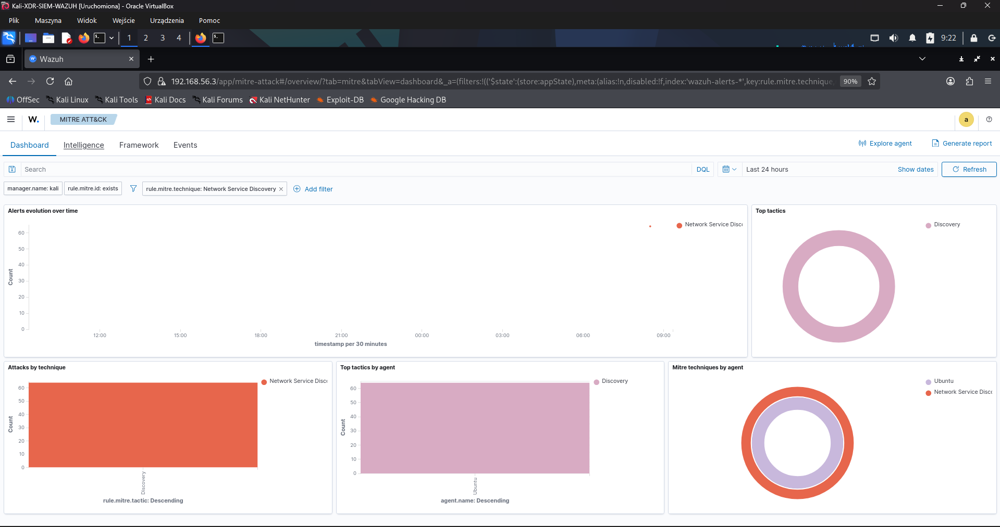
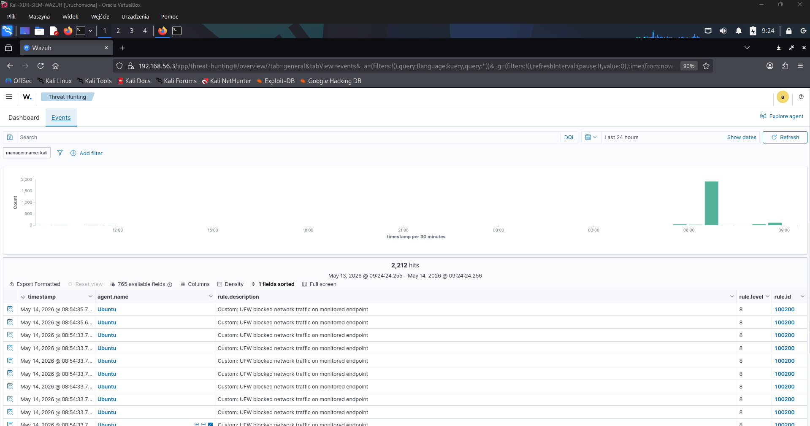
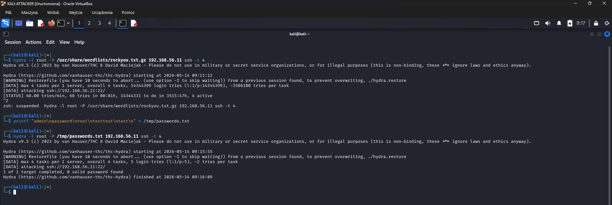
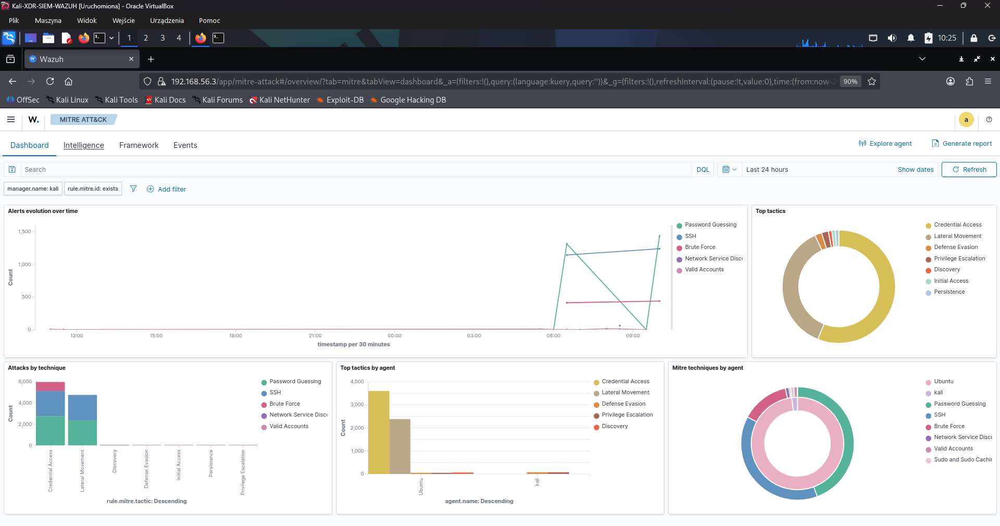
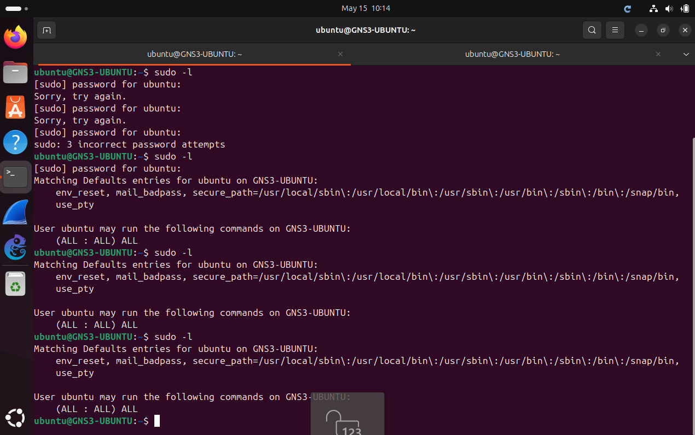
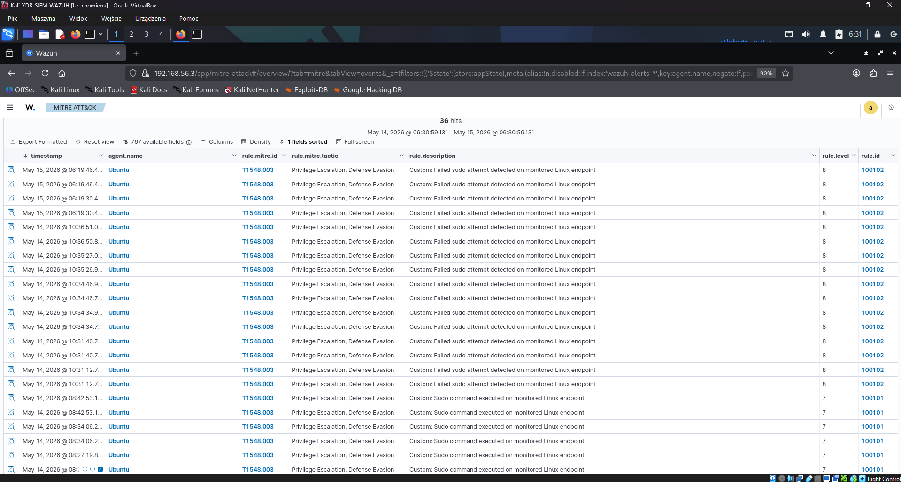
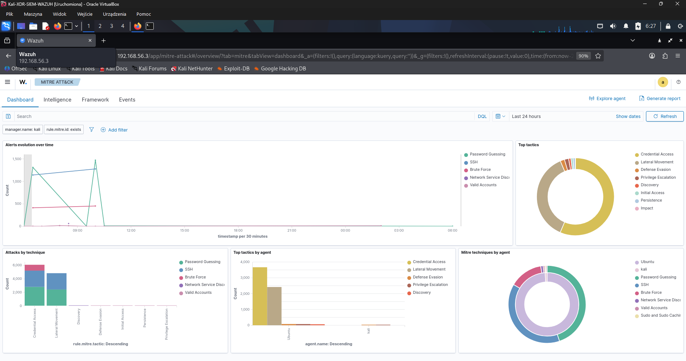

# Attack Scenarios

## Scope

This document contains controlled attack scenarios used to generate security events in the Wazuh lab.

## Lab machines

| Machine | Role | IP address |
|---|---|---:|
| Kali Linux | Attacker machine | 192.168.56.30 |
| Ubuntu Linux | Monitored endpoint | 192.168.56.11 |
| Kali Linux | Wazuh Manager, Indexer and Dashboard | 192.168.56.3 |

## Scenario 1: Nmap SYN scan

### Source

```text
Kali attacker: 192.168.56.30
```

### Target

```text
Ubuntu endpoint: 192.168.56.11
```

### Command

Run on the Kali attacker machine:

```bash
sudo nmap -sS 192.168.56.11
```

### Purpose

Identify open TCP ports on the monitored Ubuntu endpoint.

### Evidence

Kali attacker command output:



Wazuh alert:




### Notes

To generate Wazuh alerts for the Nmap scan, UFW logging was enabled on the Ubuntu endpoint and a local Wazuh rule was added for blocked firewall traffic.

The scan was detected through firewall logs, not by packet sniffing. Wazuh analyzed the endpoint logs and mapped the alert to MITRE ATT&CK technique T1046 - Network Service Discovery.

## Scenario 2: SSH brute-force with Hydra

### Source

```text
Kali attacker: 192.168.56.30
```

### Target

```text
Ubuntu endpoint: 192.168.56.11
```

### Command

Run on the Kali attacker machine:

```bash
hydra -l root -P /usr/share/wordlists/rockyou.txt.gz 192.168.56.11 ssh -t 4
```

Optional short test list:

```bash
printf "admin\npassword\nroot\n123456\nwrongpass\n" > /tmp/passwords.txt
hydra -l root -P /tmp/passwords.txt 192.168.56.11 ssh -t 4
```

### Purpose

Generate repeated failed SSH authentication attempts.

### Evidence

Kali command output:



Wazuh alert:



### Related rule

Local rule file:

[`wazuh/rules/local_rules.xml`](../wazuh/rules/local_rules.xml)

Relevant custom rule:

```text
100100 - Possible SSH brute-force attack detected on monitored endpoint
```

## Scenario 3: Sudo command execution and failed sudo attempt

### Source

```text
Ubuntu endpoint: 192.168.56.11
```

### Command

Run a sudo command on the Ubuntu endpoint and test both correct and incorrect password attempts:

```bash
sudo -l
```

### Purpose

Generate sudo-related authentication events on the monitored endpoint, including successful command execution and failed sudo authentication.

### Evidence

Ubuntu command output:



Wazuh alert:




### Related rules

Local rule file:

[`wazuh/rules/local_rules.xml`](../wazuh/rules/local_rules.xml)

Relevant custom rules:

```text
100101 - Sudo command executed on monitored Linux endpoint
100102 - Failed sudo attempt detected on monitored Linux endpoint
```

### Notes

In Wazuh Dashboard, sudo-related events should be checked under MITRE ATT&CK as `Privilege Escalation`.

The related MITRE technique is `T1548.003 - Sudo and Sudo Caching`.

## Scenario summary

| Scenario | Source | Target | Tool / command | Expected event |
|---|---|---|---|---|
| Nmap SYN scan | Kali attacker | Ubuntu endpoint | `nmap -sS` | Port scan / network reconnaissance |
| SSH brute-force | Kali attacker | Ubuntu endpoint | `hydra` | Failed SSH authentication |
| Sudo command execution and failed sudo attempt | Ubuntu endpoint | Ubuntu endpoint | `sudo -l` with correct & wrong password | Sudo command execution & Failed sudo authentication |
