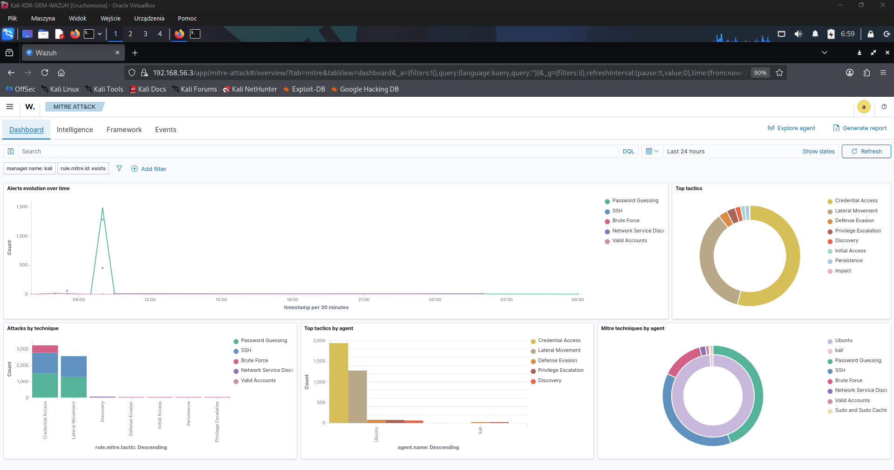

# Alerts and MITRE ATT&CK Mapping

## Scope

This document summarizes how selected Wazuh alerts from the lab were mapped to MITRE ATT&CK techniques.

Detailed attack commands and evidence screenshots are documented in:

[`05-attack-scenarios.md`](05-attack-scenarios.md)

## Mapping summary

| Scenario | Wazuh rule | MITRE tactic | MITRE technique |
|---|---:|---|---|
| Nmap SYN scan detected from UFW logs | 100200 | Discovery | T1046 - Network Service Discovery |
| SSH brute-force attempt | 100100 | Credential Access | T1110 - Brute Force |
| Sudo command execution | 100101 | Privilege Escalation | T1548.003 - Sudo and Sudo Caching |
| Failed sudo attempt | 100102 | Privilege Escalation | T1548.003 - Sudo and Sudo Caching |

## Alert sources

| Alert type | Source log | Collected by |
|---|---|---|
| Nmap / network scan | UFW firewall logs | Wazuh Agent |
| SSH brute-force | `/var/log/auth.log` | Wazuh Agent |
| Sudo activity | `/var/log/auth.log` | Wazuh Agent |

## MITRE ATT&CK dashboard

The Wazuh MITRE ATT&CK dashboard was used to confirm that alerts were grouped under the correct tactics and techniques.

Main observed techniques:

- `T1046 - Network Service Discovery`
- `T1110 - Brute Force`
- `T1548.003 - Sudo and Sudo Caching`

## Notes

The Nmap scan required endpoint firewall logging because Wazuh analyzes collected logs, not raw packets.

SSH and sudo detections were based on standard Linux authentication logs.

Local rules used in this lab are stored in:

[`wazuh/rules/local_rules.xml`](../wazuh/rules/local_rules.xml)